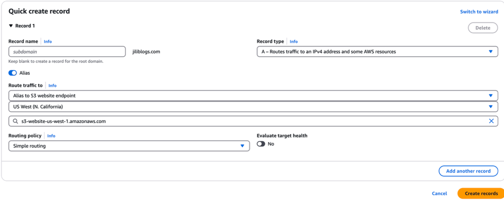
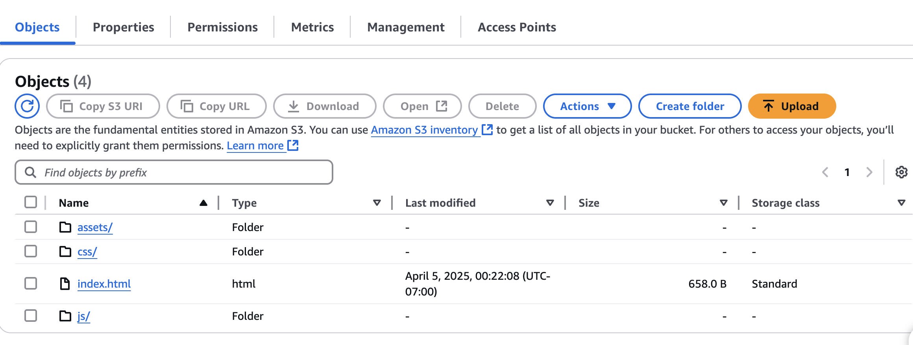
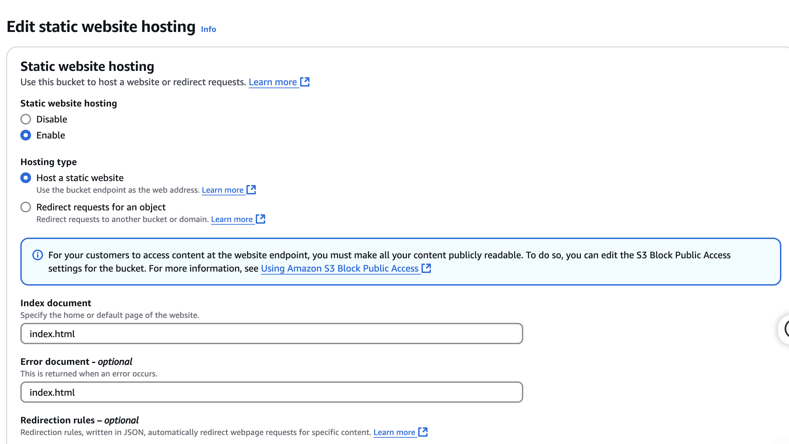
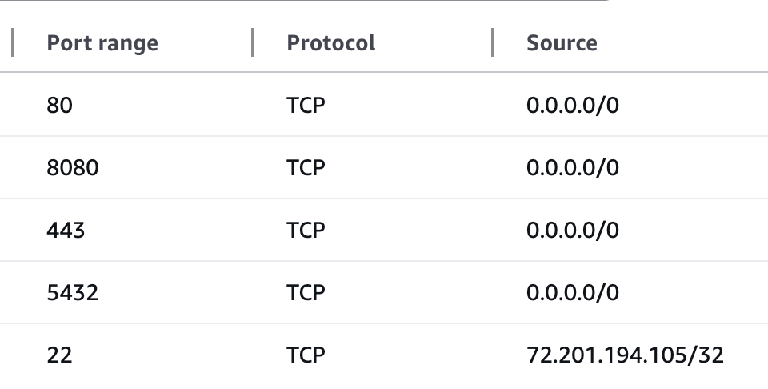
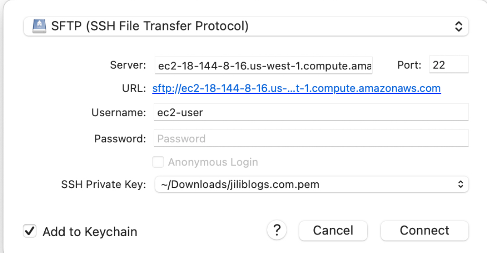

## Intro
I deployed my project on AWS.
* domain: AWS Route 53
* Frontend and static resources: AWS S3 
* Backend: AWS EC2
* Database: AWS RDS

## Choose your favorite domain
[Route 53 official website](https://us-east-1.console.aws.amazon.com/route53/domains/home?region=us-west-1#/DomainSearch)

## AWS S3
1. Create a bucket, use `domain name` as bucket name.
2. Uncheck "Block all public access" (so people can access it)
3. Paste the following configuration into bucket policy:
```
{
    "Version":"2012-10-17",
    "Statement":[
        {
            "Sid":"PublicReadGetObject",
            "Effect":"Allow",
            "Principal":"*",
            "Action":[
                "s3:GetObject"
             ],
             "Resource":[
                 "arn:aws:s3:::jiliblogs.com/*"
            ]
        }
    ]
}
```
4. Redirect Route 53 to S3: create a record for the domain on Route 53 page.

5. upload the frontend files.



## AWS RDS
1. create database, choose postgresql with free tier, and set own username and password.
2. export data from local database into a sql file: `pg_dump -U [username] -h localhost -d [database] -F c -f backup.sql`
3. upload sql file: `psql -U [username] -d [database] -f [sql file] -h [RDS endpoint]`
4. connect to AWS DB: `psql -U root -d [database] -h [RDS endpoint] -p 5432`

## AWS EC2
1. launch an instance(Ubuntu) on EC2
2. set security configurations
Allow Inbound Rules:
HTTP (80) → 0.0.0.0/0 (Make API public)
HTTPS (443) → 0.0.0.0/0
Custom TCP (8080) → 0.0.0.0/0 (if backend runs on 8080)
TCP (5432) → 0.0.0.0/0 (for Postgresql)
SSH (22) → Only your IP (for security)


3. download pem file, this file only need to download at the first time you launch instance.
4. run `chmod 400 [pem path]`
5. run `ssh -i [pem path] ec2-user@[Public IPv4 DNS]` to connect to the instance
6. run `sudo yum install java-11`
7. upload jar file. Before we build jar file, make sure you changed the database address. I used `cyberduck` app. also can use this command `scp -i [key.pem path] [backend jar file] ubuntu@[ec2-ip]:/home/ubuntu` 


8. run jar file `nohup java -jar backend.jar --server.port=8080 > log.txt 2>&1 &`. `nohup` make sure even if the terminal is closed the process is still keep running. `&` makes sure the process is running background. and the output will be written in log.txt.

## Subdomain
1. create a subdomain to store files, for example, I use `img.jiliblogs.com` to store the pictures in my articles.
2. Set up subdomains in Route 53 -> select hosted zone (like `jiliblogs.com`) -> create a new record -> name is img, this can create a url `img.jiliblogs.com`, value is the endpoint we will use (I use S3 to store img), type is A-Routes traffic to an IPv4 address
3. create a new bucket in S3, the name need to be same as the subdomain we created. Upload a html file as a placeholder is required.
4. Go back to Route 53 and edit the record we just created. Set it as "Alias", choose the S3 website endpoint and the route can be filled automatically.
   