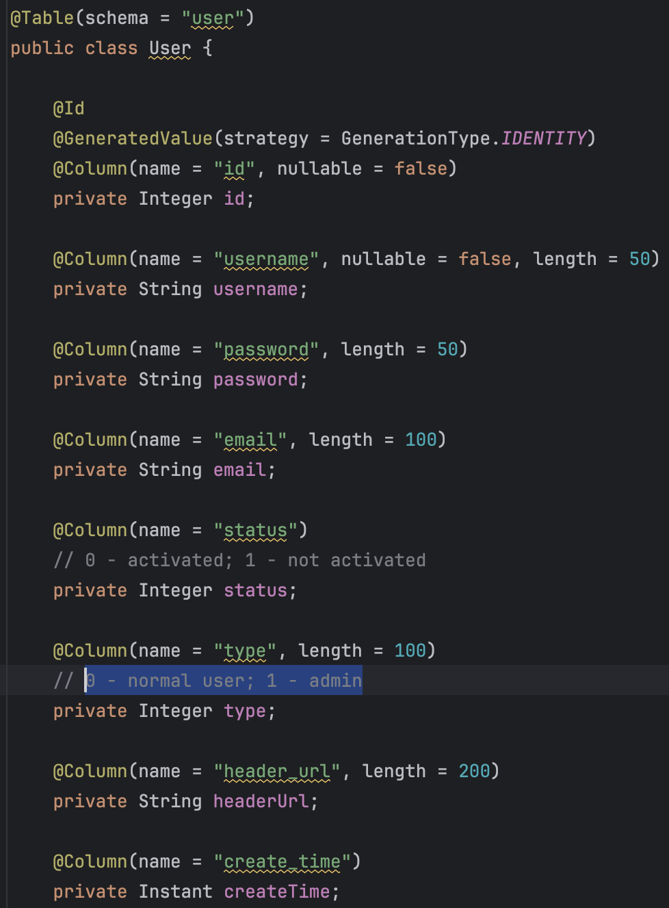
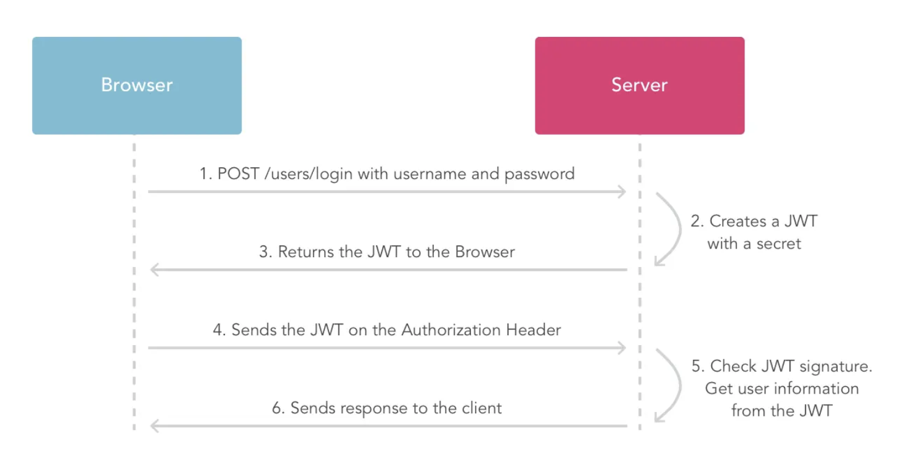

## The following content is about how I design the user
### The users database schema is like this:

### Flow Diagram

#### Frontend
1. When users log in, React stores the user token in both localStorage and the request header (config.headers.Authorization in Redux).

    * If localStorage is not null, it means the user is already logged in, and the token will be initialized accordingly.
    * Every request includes an Authorization field, which the server uses to verify whether the request is valid.
2. If the browser needs user information, the server retrieves it using the token and then stores it in Redux.
3. The following are the core code 
```js
// manage user-related states
import { createSlice } from "@reduxjs/toolkit";
import { getToken, request, setToken as _setToken, removeToken } from "@/utils";
import { getProfileAPI, loginAPI } from "@/apis/user";

const userStore = createSlice({
    name: "user",
    // initial state
    initialState: {
        // if localstorage haven't saved the token, then initiate it as a null string
        token: getToken() || '',
        UserInfo: {}
    },
    // update data
    reducers: {
        setToken(state, action) {
            state.token = action.payload
            // save token into localStorage
            _setToken(action.payload)
            // console.log("token: " + action.payload)
        },
        setUserInfo(state, action) {
            state.UserInfo = action.payload
            // console.log(action.payload.username)
        },
        clearUserInfo(state) {
            state.token = ''
            state.UserInfo = {}
            removeToken()
        }
    }
})

// Destructure the actionCreater
const { setToken, setUserInfo, clearUserInfo } = userStore.actions

// get reducer method
const userReducer = userStore.reducer

// asynchronous login
const fetchLogin = (loginForm) => {
    return async (dispatch) => {
        // send asynchronous request
        const res = await loginAPI(loginForm)
        console.log(res);
        // submit synchronous action to save token
        dispatch(setToken(res.token))
    }
}

// asynchronous get user info 
const fetchUserInfo = () => {
    return async (dispatch) => {
        // we have set token in request header (in request.js), so the server can tell which user is asking
        const res = await getProfileAPI()
        // if(res.)
        dispatch(setUserInfo(res.data))
    }
}

export { fetchLogin, fetchUserInfo, clearUserInfo }

export default userReducer
```

#### Backend
1. When the server receives a login request from the browser, it not only verifies the username and password but also responds with necessary information in JSON format:

    * If authentication fails:
```json
{
    "message": "failed",
    "reason": "username doesn't exist/wrong password"
}
```
    * If authentication is successful:
```json
{
    "message": "successful",
    "token": "(JWT token containing user info)"
}
```
2. When the server needs to retrieve user information, it parses the token to extract the stored data:
```json
{
    "message": "successful/invalid token",
    "data": {
        "UserInfo": {
            "id": "1",
            "username": "haha"
            ...
        }
    }
}
```
3. The following are the core code of generating token with JWT.
dependencies:
```xml
<!--		 jwt-->
<!-- https://mvnrepository.com/artifact/io.jsonwebtoken/jjwt-api -->
<dependency>
   <groupId>io.jsonwebtoken</groupId>
   <artifactId>jjwt-api</artifactId>
   <version>0.12.6</version>
</dependency>
<!-- https://mvnrepository.com/artifact/io.jsonwebtoken/jjwt-impl -->
<dependency>
   <groupId>io.jsonwebtoken</groupId>
   <artifactId>jjwt-impl</artifactId>
   <version>0.12.6</version>
   <scope>runtime</scope>
</dependency>
<!-- https://mvnrepository.com/artifact/io.jsonwebtoken/jjwt-jackson -->
<dependency>
   <groupId>io.jsonwebtoken</groupId>
   <artifactId>jjwt-jackson</artifactId>
   <version>0.12.6</version>
   <scope>runtime</scope>
</dependency>
```

```java
package com.personalblog.backend.utils;

import com.alibaba.fastjson2.JSONObject;
import io.jsonwebtoken.*;
import io.jsonwebtoken.io.Decoders;
import io.jsonwebtoken.security.Keys;
import jakarta.annotation.PostConstruct;
import org.springframework.beans.factory.annotation.Value;
import org.springframework.context.annotation.Bean;
import org.springframework.http.HttpStatus;
import org.springframework.http.ResponseEntity;
import org.springframework.stereotype.Component;

import javax.crypto.SecretKey;
import java.util.*;

@Component
public class JWTUtils {

    // the secretKey is different everytime reboot, so i store it in application.properties file and load it when service starts.
//    private static final MacAlgorithm alg = Jwts.SIG.HS512; //or HS384 or HS256
//    private static final SecretKey key = alg.key().build();

    @Value("${jwt.secret}") // Inject the secret key
    private String secretKey;  // Non-static variable to receive value

    private static String baseString; // Static variable to be used everywhere

    @PostConstruct // Runs after Spring initializes the bean
    public void init() {
        baseString = secretKey; // Assign injected value to static variable
    }

    public static String createToken(String username) {
        byte[] keyBytes = Decoders.BASE64.decode(baseString);
        SecretKey sk = Keys.hmacShaKeyFor(keyBytes);

        // custom claim
        Map<String, Object> inputClaims = new HashMap<>();

        inputClaims.put("username", username);

        // 2 approaches: sign or encrypt
        String token = Jwts.builder()
                // Specifies the issuer of the token, server can make sure the token is from this server
                .issuer("auth-server")
                // specify who the token is meant for.
                .subject("username")
                .claims(inputClaims)
                // optional, the audience of the token, server can make sure this token is made for specific client while parsing it.
                .audience().add("api-client").and()
                // optional
//                .notBefore(notBefore)
                // issue time is current time
                .issuedAt(new Date())
                // expiration time in 2 days
                .expiration(new Date(System.currentTimeMillis() + 48 *60 * 60 * 1000))
                // randomly generate an unique identifier
                .id(UUID.randomUUID().toString())
                // sign
                .signWith(sk)
                // encrypt
//                .encryptWith(key, Jwts.ENC.A256CBC_HS512)
//                generate a token and compact to a string
                .compact();
        return token;
    }

    public static Claims parseToken(String token) {
        byte[] keyBytes = Decoders.BASE64.decode(baseString);
        SecretKey sk = Keys.hmacShaKeyFor(keyBytes);

        // parse
        Claims claims = Jwts.parser()
                .verifyWith(sk)
                .build()
                // if token was made by sign approach
                .parseSignedClaims(token)
                // get the contents after decryption
                .getPayload();

//        System.out.println(claims.getExpiration().getTime());
//        String username = claims.get("username", String.class);
        return claims;
    }

    public static String getUsername(String token) {
        if(token == null || !token.startsWith("Bearer ")){
            Map<String, Object> map = new HashMap<>();
            map.put("failed", "please login first");
            return null;
        }
        Claims claims = parseToken(token);
        // token expired
        if(claims.getExpiration().getTime() < System.currentTimeMillis()){
            return null;
        }
        return claims.get("username", String.class);
    }
}

```
