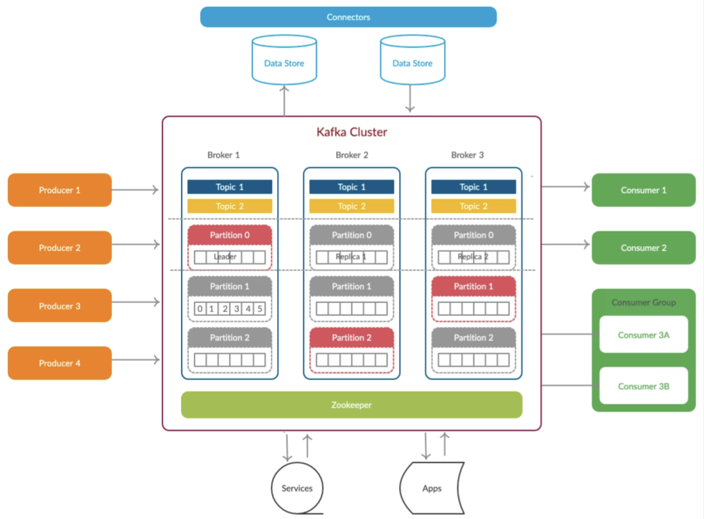
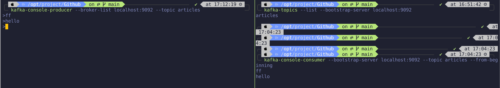

## what is Kafka
Kafka is a distributed event streaming platform that allows you to:

* Publish and subscribe to streams of records (messages).

* Store streams of records in a fault-tolerant way.

* Process streams of records in real-time.

Key Concepts:

* Producer: Sends messages to Kafka.

* Consumer: Reads messages from Kafka.

* Topic: A category or feed name to which messages are sent.

* Broker: A Kafka server that stores data and serves clients.

* Zookeeper: Manages Kafka brokers and maintains metadata.

## setup
1. install: `brew install kafka`
2. set gobal command so that we don't need to type a long command every time: `nvim ~/.zshrc`
```
alias zookeeper='/opt/homebrew/bin/zookeeper-server-start /opt/homebrew/etc/kafka/zookeeper.properties'
alias kafka-server='/opt/homebrew/bin/kafka-server-start /opt/homebrew/etc/kafka/server.properties'
```
then run `source ~/.zshrc`

3. run `zookeeper` and `kafka-server`
4. create a topic `kafka-topics --create --topic [topic name] --partitions 1 --replication-factor 1 --bootstrap-server localhost:9092`
5. create a producer `kafka-console-producer --broker-list localhost:9092 --topic [topic name]`
6. create a consumer `kafka-console-consumer --bootstrap-server localhost:9092 --topic articles --from-beginning`
7. test


## code
1. dependencies
```xml
<!-- https://mvnrepository.com/artifact/org.springframework.kafka/spring-kafka -->
<dependency>
   <groupId>org.springframework.kafka</groupId>
   <artifactId>spring-kafka</artifactId>
   <version>3.3.3</version>
</dependency>
```
2. i created an entity Event to save all messages, like comments, articles, likes, follow and type stuff:
```java
public class Event {

    // article, like, follow, or comment
    private String topic;
    // author,
    private int userId;
    private int entityType;
    private int entityId;
    private int entityUserId;
    private Map<String, Object> data = new HashMap<>();
}
```
if the notification is about a new article, the meaning of variables are:
* topic: article
* userId: author Id
* entityType: article
* entityId: article Id
* entityUserId: null
* data: null

if the message is a comment, the structure is:
* topic: comment
* userId: comment about who
* entityType: comment
* entityId: comment Id
* entityUserId: who posted this comment
* data: comment content

the other messages will be similar with them.
3. producer:
```java
@Component
public class EventProducer {

    @Autowired
    private KafkaTemplate<String, String> kafkaTemplate;

    @Autowired
    private ArticleRepository articleRepository;

    public void sendMessage(Event event) {
        kafkaTemplate.send(event.getTopic(), JSONObject.toJSONString(event));
    }

}
```
when a new article be posted, send a message to kafka:
```java
// send message to kafka
Event event = new Event()
       .setTopic(TOPIC_ARTICLE)
       .setUserId(user.getId())
       .setEntityType(1)
       .setEntityId(articleId);
eventProducer.sendMessage(event);
```
consumer
```java
@Component
public class EventConsumer implements Constant {

    private static final Logger logger = LoggerFactory.getLogger(EventConsumer.class);

    @Autowired
    private ArticleService articleService;

    @Autowired
    private ArticleSearchRepository articleSearchRepository;

    @Autowired
    private ChannelRepository channelRepository;

    @KafkaListener(topics = {TOPIC_ARTICLE})
    public void handleArticleMessage(String message) {
        if (message == null) {
//            logger.error("empty message!");
            return;
        }

//        System.out.println(message);

        Event event = JSONObject.parseObject(message, Event.class);
        System.out.println(event.toString());
        if (event == null) {
            logger.error("消息格式错误!");
            return;
        }

        Article article = articleService.getArticleById(event.getEntityId());
        Optional<Channel> channel = channelRepository.findById(article.getChannel());

        assert channel.orElse(null) != null;
        ArticleDocument esArticle = new ArticleDocument(
                        article.getId(),
                        article.getTitle(),
                        article.getUserId().toString(),
                        article.getContent(),
                        channel.orElse(null).getName()
                );

        articleSearchRepository.save(esArticle);  // Save to Elasticsearch
    }
}

```